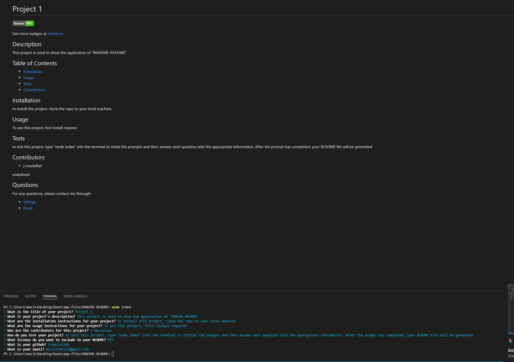

  # MAKEME-README
  
  
  ## Purpose
  This application uses inquirer prompts to get user input and then uses that input to generate a README

  ## Outline
  * The user begins the prompts by entering "node index" into the terminal
  * The user is then prompted to answer a series of questions that will be the content of their README
  * Once the questions are finished, the README will be generated and placed in the dist folder

  ## Built With
  * Javascript
  * Node.js
  * Inquirer

  ## Image
  

  ## Video Link
  [Video Link](https://drive.google.com/file/d/146z0qj5K62COXdgAM1imKHU4X5FhTJ5T/view)

  ## Contributors
  * j-maclellan
